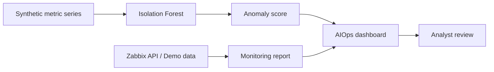

# Architecture

```mermaid
flowchart LR
    A[Zabbix API / Demo data] --> B[Monitoring report]
    C[Synthetic metric series] --> D[Isolation Forest]
    D --> E[Anomaly score]
    E --> F[AIOps dashboard]
    B --> F
    F --> G[Analyst review]
```

Live Zabbix access is optional. The public repository defaults to demo mode and contains no production credentials or internal infrastructure data.
